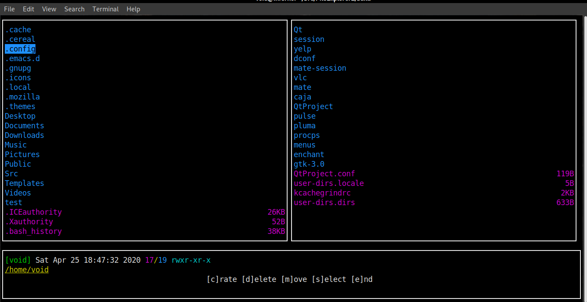
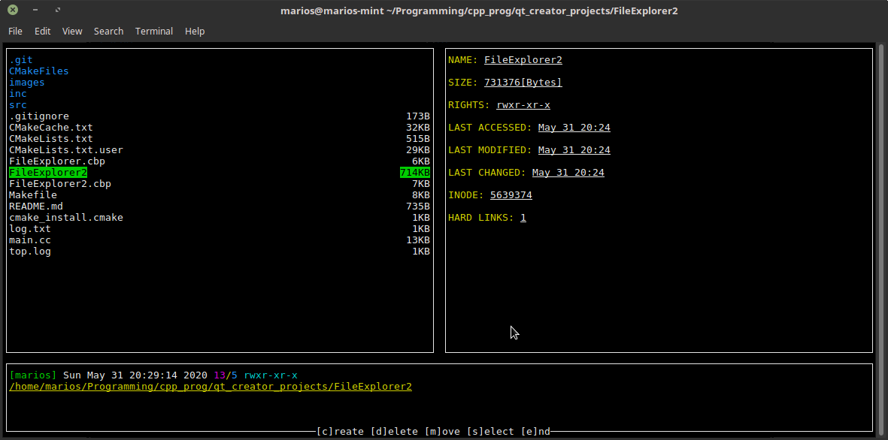

# FileExplorer2

## This project was made for fun and does not aim to be efficient in any way!

# Features
1. Stat information about each file is displayed.
2. Move/delete/create files/directories.
3. Easier window management through the Scene class.
4. All windows are resizable.
5. Priview the contents of a directory.
6. A simple line scrolling mechanism.
7. Select multiple lines inside of a window.
8. Dialog windows.

# Requirements

**g++-8.3**, **make**, **cmake-2.8**, **ncurses**

# Screenshots

