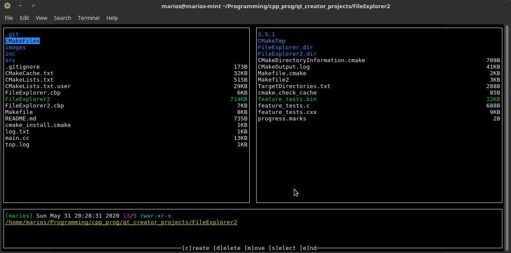

# FileExplorer2
A better version of FileExplorer.

## This project was made for fun and does not aim to be efficient in any way!

It is based on the idea of the first FileExplorer and was created as an improvement uppon it's predecessor.

# Features
1. Stat information about each file is displayed.
2. move and delete files/directories.
3. Easier window management through the Scene class.
4. All windows are resizable.
5. Priview the contents of a directory.
6. Custom scrolling of the lines of a window.
7. Select multiple lines inside of a window.
8. Dialog windows.

# Requirements

**g++**, **make/cmake**, **ncurses**

# Screenshots

